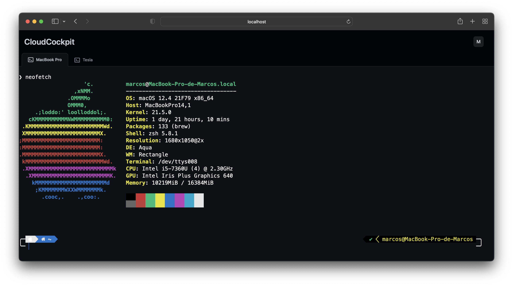
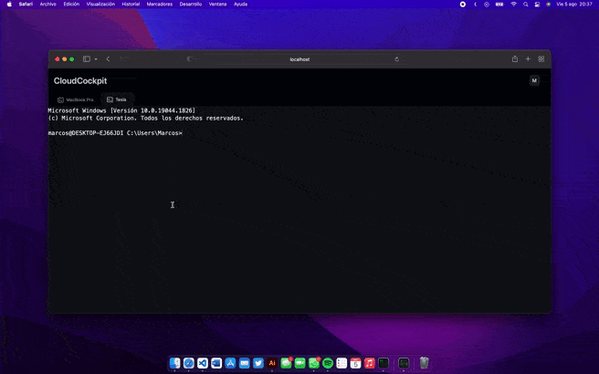
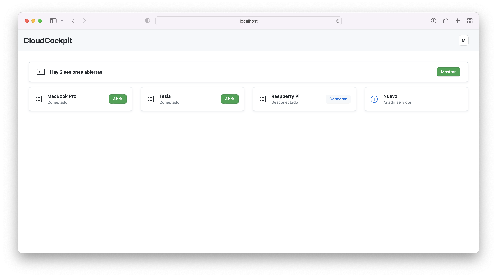
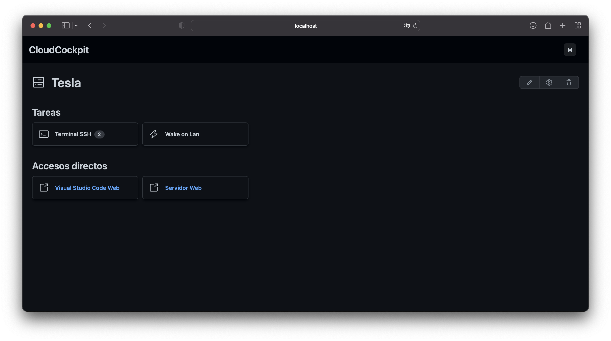
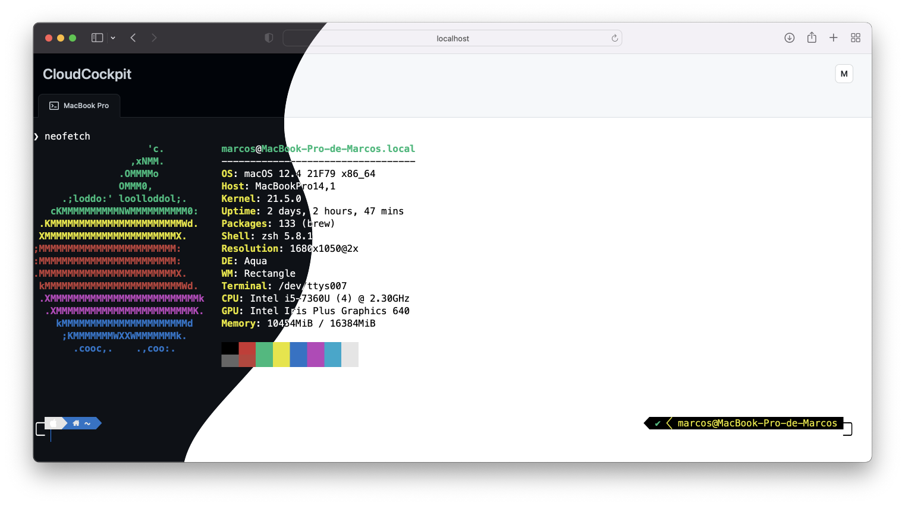

<div align="center">
	

# CloudCockpit
</div>

CloudCockpit es (por ahora) un emulador de terminal basado en tecnologías web escrito enteramente en TypeScript.\
Usa Angular para representar la terminal y NodeJS para crear pseudo terminales.

Bajo el capó, Node agre un servidor WebSockets para comunicarse con el cliente rápidamente. Cuando el cliente da la orden, se abre una conexión SSH con un servidor previamente especificado.\
Cuando el servidor SSH responde, el servidor de CloudCockpit se encarga de redirigir la salida al cliente, que posteriormente trata los datos usando [xtermjs](https://xtermjs.org).

## 🔄 Actualización

### 🎨 Cambio de interfaz.

En la última versión se usa [primer](https://primer.style) para la interfaz de usuario.

### 🔌 Múltiples conexiones simultáneas.

Se ha añadido soporte multiservidor, ahora se pueden abrir varias conexiones simultáneas a diferentes servidores.

### 👀 Pestañas


Sistema de pestañas para el intercambio entre terminales.

### 📖 Menú principal


Se ha añadido un menú principal para mostrar los servidores configurados y gestionar las conexiones.

### 🖥 Menú del servidor


Se ha añadido un menú intermedio para gestionar snippets y terminales a servidores.

Además incluye una sección de accesos directos para abrir aplicaciones web rápidamente.

### ☀️ 🌑 Soporte para modo claro y oscuro



Además de la interfaz de usuario, las terminales también se adaptan al modo de esquema de color del sistema de forma automática.

## 💿 Instalación

Clonar el repositorio `https://github.com/marcosrg9/CloudCockpit.git`, después acceder a él.

A continuación se deben instalar las dependencias:

	npm i

Iniciar el servidor con el comando start:

	npm start

Después abrir otra terminal en el mismo directorio y acceder al directorio `public`.

Instalar las dependencias de Angular igual que las de NodeJS (`npm i`).

Por último iniciar el servidor de desarrollo de Angular

	npm start

Para permitir el acceso desde otros hosts (para lo cual ha sido diseñado este software), iniciar el servidor de la siguiente forma:

	ng serve --host=0.0.0.0

En caso de no disponer de Angular CLI instalado de forma global, usar el siguiente comando:

	npx ng serve --host=0.0.0.0

CloudCockpit ha sido probado bajo Zsh, Bash y Ash (en Alpine Linux), además de la terminal de Windows (bajo Windows 10), todos han tenido un comportamiento normal teniendo en cuenta las siguientes limitaciones.

CloudCockpit no incluye ninguna base de datos todavía, el acceso es completamente abierto, por lo tanto en el login solamente debe pulsa en el botón de iniciar sesión tal cual.

## 🔍 Depuración

Se incluyen las herramientas necesarias para depurar la CloudCockpit bajo Visual Studio Code.

Existen 2 configuraciones:

- Launch TypeScript: depura el servidor, lanzarlo estando en el directorio raíz.

- Launch Chrome: depura el frontend, lanzar el servidor de angular y después lanzar esta configuración. Se abrirá una ventana de Chrome.

> Nota: si se depura en Chrome, las pestañas que se abran también aparecen en el depurador, tener esto en cuenta a la hora de observar la pila de llamadas.

## 🐞 Bugs

- Faltan secuencias de escape por configurar, por ejemplo, <kbd>Shift</kbd> + <kbd>Tab</kbd> no funciona.

- No existe ningún administrador de sesiones, por lo tanto si el cliente se desconecta, las terminales no reaparecen, ⚠️ **pero continúan abiertas del lado del servidor**. No hay intenciones de solucionar esto, pues es el comportamiento esperado cuando el administrador de sesiones esté configurado.

- La primera instanciación de una terminal, por alguna razón tarda bastante tiempo (10 segundos aproximadamente), cuando ya existe una terminal activa, la instanciación es casi inmediata (lo justo para conectarse al servidor SSH). Afecta de forma negativa a la experiencia de usuario. Hay sospechas de que xterm o el addon xterm-addon-fit está provocando esto. Si se redimensiona la ventana mientras se está cargando la terminal, la instanciación dura bastante menos.

## ✅ Bugs corregidos

- Las mayor parte de las secuencias de escape ya están incluidas en el cliente, por lo que pulsaciones de tipo <kbd>Control</kbd> + <kbd>C</kbd> ya funcionan correctamente.

- Las flechas funcionan correctamente. Previamente se usaba [node-pty](https://github.com/microsoft/node-pty) para abrir terminales en el propio servidor, sin embargo la idea era abrir conexiones SSH con otros servidores, por lo que el cambio a [ssh2](https://github.com/mscdex/ssh2) hace que se interpreten correctamente estas teclas.

- Anteriormente había un bug que indicaba que la base de datos era inaccesible, lo que impedía usar ```clear``` o la utilidad ```nano```, este error estaba relacionado con node-pty, al cambiar a ssh2, este error ha desaparecido.

- El historial funciona correctamente, pues es gestionado por el propio servidor SSH.

## ⚠️ Advertencia

CloudCockpit no es una herramienta de alta seguridad, y además está en una fase de desarrollo temprana.

Los servidores HTTP y WebSocket no corren bajo protocolos seguros (https y wss), no se incluyen certificados de ningún tipo y no se garantiza la privacidad de los datos transmitidos entre el servidor y el cliente.

Se recomienda usar esta herramienta con precaución y siempre bajo redes seguras y conocidas.

No se han realizado pruebas de rendimiento, por lo tanto el servidor y el cliente pueden tener problemas que afectan severamente al rendimiento general, por lo que su uso en producción está totalmente desaconsejado.

## 📖 Documentación importante

Las secuencias de escape es uno de los factores más importantes para interactuar con la terminal (por no decir que el que más).

Hay bastante documentación en la web, sin embargo es complejo de compreder, xtrem.js tienen documentación algo más sencilla de entender, además en foros se puede encontrar más información para saber cómo insertar estas secuencias.

Algunas páginas que han sido de gran utilidad a la hora de desarrollar CloudCockpit:

- https://xtermjs.org/docs/api/vtfeatures/
- https://www.windmill.co.uk/ascii-control-codes.html
- https://en.wikipedia.org/wiki/C0_and_C1_control_codes#C0_(ASCII_and_derivatives)
- https://stackoverflow.com/a/31017139
- https://gist.github.com/fnky/458719343aabd01cfb17a3a4f7296797