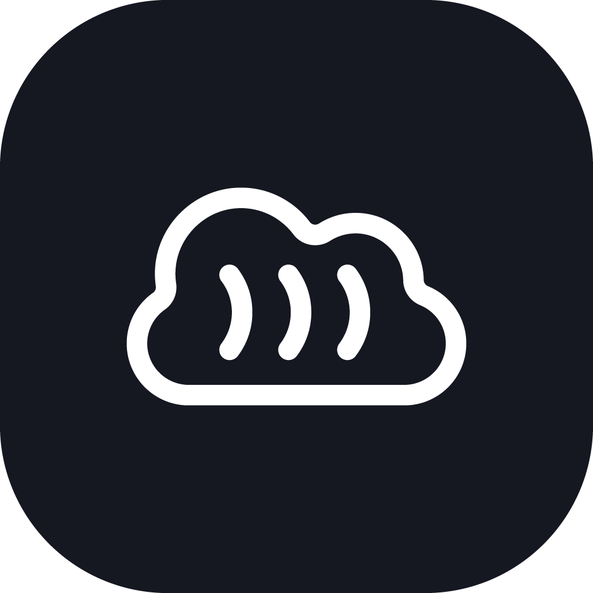

<div align="center">
<picture>
  <source width="100px" media="(prefers-color-scheme: dark)" srcset="./.src/logo/cloudcockpit_logo-light.png">
  
</picture>

# CloudCockpit
</div>


CloudCockpit es una plataforma para administrar servidores remotos mediante el protocolo SSH a través de un navegador.

Para gestionar las terminales y conexiones en el servidor se usa NodeJS. Para representar la plataforma y las terminales se usa Angular. Para la persistencia de datos se usa MongoDB.

Cuando el servidor SSH responde, el servidor de CloudCockpit se encarga de redirigir la salida al cliente, que posteriormente trata los datos usando [xtermjs](https://xtermjs.org).

## 🔄 Actualización

### 🔗 Sesiones vinculadas

CloudCockpit vinculan todas las sesiones a un usuario, cuando dos dispositivos inician sesión en la platadorma y uno de ellos abre una terminal, el otro también visualizará dicha terminal.

Puedes abrir una terminal SSH desde el navegador de tu PC y continuar el trabajo en tu equipo portátil sin perder la conexión.

Asegúrate de que al menos uno de los dispositivos mantenga la conexión, después de 5 minutos, todas las sesiones vinculadas a un usuario se cierran.

### 👔 Administración

Los usuarios administradores tienen nuevas secciones donde visualizar partes internas de la plataforma:

- **Usuarios**: Gestiona los usuarios de la plataforma.

- **Cifrado**: Permite saber si el servidor incorpora claves criptográficas válidas, y de ser así, opciones para descifrar la base de datos o volver a cifrarla con otra clave.

- **Sesiones**: Podrás visualizar los usuarios con sesión iniciada en el servidor.

- **Socket**: Visualiza todo dispositivo conectado en tiempo real al servidor, así como la dirección IP y la capacidad de desconectarlo del mismo.

- **Logs**: Muestra información de algunos eventos internos del servidor:
	- Eventos de servidor (carga de almacenes en memoria, conexión a base de datos)
	- Eventos de usuarios.
	- Eventos de rendimiento (detección de filtrado de memoria).
	- Eventos de errores (proceso, base de datos)

### 🧑‍✈️ Asistente de configuración

La primera vez que abras CloudCockpit, se te redirigirá a un asistente de configuración para establecer ciertos parámetros para el funcionamiento correcto de la plataforma.

### 🎨 Cambio de interfaz.

En la última versión se usa [primer](https://primer.style) para la interfaz de usuario.

### 🔌 Múltiples conexiones simultáneas.

Se ha añadido soporte multiservidor, ahora se pueden abrir varias conexiones simultáneas a diferentes servidores.

### 👀 Pestañas


Sistema de pestañas para el intercambio entre terminales.

### 📖 Menú principal


Se ha añadido un menú principal para mostrar los servidores configurados y gestionar las conexiones.

### 🖥 Menú del servidor


Se ha añadido un menú intermedio para gestionar snippets y terminales a servidores.

Además incluye una sección de accesos directos para abrir aplicaciones web rápidamente.

### ☀️ 🌑 Soporte para modo claro y oscuro


Además de la interfaz de usuario, las terminales también se adaptan al modo de esquema de color del sistema de forma automática.

## 💿 Instalación

Clonar el repositorio `https://github.com/marcosrg9/CloudCockpit.git`, después acceder a él.

A continuación se deben instalar las dependencias:

	npm i

Iniciar el servidor con el comando start:

	npm start

Después abrir otra terminal en el mismo directorio y acceder al directorio `public`.

Instalar las dependencias de Angular igual que las de NodeJS (`npm i`).

Por último iniciar el servidor de desarrollo de Angular

	npm start

Para permitir el acceso desde otros hosts (para lo cual ha sido diseñado este software), iniciar el servidor de la siguiente forma:

	ng serve --host=0.0.0.0

En caso de no disponer de Angular CLI instalado de forma global, usar el siguiente comando:

	npx ng serve --host=0.0.0.0

Abrir un navegador en la ruta indicada e insertar los parámetros de autenticación:
- Usuario: admin
- Contraseña: admin

⚠️ Nota: cambiar las credenciales desde los ajustes de la plataforma.

CloudCockpit ha sido probado bajo Zsh, Bash y Ash (en Alpine Linux), además de la terminal de Windows (bajo Windows 10), todos han tenido un comportamiento normal.

## 🔧 Configuración

CloudCockpit usa MongoDB como base de datos, y necesita los parámetros de acceso, los cuales se detallan a continuación.

Dentro del directorio raíz, renombrar el elemento ```.env.example``` a ```.env```, posteriormente rellenarlo:

- ```NODE_ENV```: Entorno de ejecución (por defecto ```dev```).
> Para entornos de producción, establecer esta variable en ```production```, esto mejorará el rendimiento de express.
- ```DB_USER```: Nombre de usuario con acceso a la base de datos.
- ```DB_PASS```: Contraseña del usuario de acceso.
- ```DB_HOST```: Dirección IP de la base de datos.
- ```DB_NAME```: Nombre de la base de datos (puede ser cualquiera)
- ```DB_AUTH```: Base de datos de la que depende el usuario para autenticarse (si consta).
- ```DB_PORT```: Puerto de la base de datos. Por defecto en MongoDB es 27017.
- ```DB_CYPH```: Valor de la clave de cifrado para datos de la base de datos (revisar siguiente punto).

> Si ```DB_AUTH``` no está establecido, puede dar lugar a errores 18.<br> En mi caso, el parámetro ```authSource``` de TypeORM solucionaba el error al establecerlo en 'admin'.

## 🔐 Cifrado de datos

CloudCockpit incorpora un mecanismo de cifrado para proteger algunos datos sensibles de la base de datos bajo el algoritmo AES 256 CBC.

Los siguientes datos están protegidos por el cifrado:
- Contraseñas
	- Inicio de sesión a la plataforma (AES + Bcrypt).
	- Autenticación SSH.
- Servidores
	- Direcciones IP.
	- Direcciones MAC.

Para configurarlo es necesario establecer una clave como valor de la variable de entorno ```DB_CYPH```, esta clave debe ser de 256 bits (32 caracteres), por ejemplo:

	DB_CYPH=7w!z%C&F)J@NcRfUjXn2r5u8x/A?D(G-

**⚠️ Advertencia** Debido a que CloudCockpit no puede determinar con exactitud si los datos han sido cifrados o no, es conveniente establecer una clave criptográfica antes de comenzar a usar la plataforma por primera vez para que no haya inconsistencia de datos cifrados en la base de datos, es decir, que el servidor dará por hecho que todo dato que debería estar cifrado, estará cifrado, y no parcialmente. Revisar las notas del desarrollador al final de este documento.

## 🔍 Depuración

Se incluyen las herramientas necesarias para depurar CloudCockpit bajo Visual Studio Code.

Existen 2 configuraciones:

- Launch TypeScript: depura el servidor, lanzarlo estando en el directorio raíz.

- Launch Chrome: depura el frontend, lanzar el servidor de angular y después lanzar esta configuración. Se abrirá una ventana de Chrome.

> Nota: si se depura en Chrome, las pestañas que se abran también aparecen en el depurador, tener esto en cuenta a la hora de observar la pila de llamadas.

## 🐞 Bugs

- Faltan secuencias de escape por configurar, por ejemplo, <kbd>Shift</kbd> + <kbd>Tab</kbd> no funciona.

- En la rama ```dev```, se han realizado cambios en la inicialización de terminales del lado del cliente, por el momento no es posible instanciar más de una terminal.

## ✅ Bugs corregidos

- Anteriormente la instanciación de la primera terminal tomaba demasiado tiempo (~10 segundos). Esto estaba siendo provocado por la implementación del hook de ciclo de vida ```ngAfterViewInit```, al cambiarlo a ```ngAfterContentChecked```, la carga de la terminal es igual al tiempo de conexión (despreciando el tiempo de instanciación de xtermjs).

- Cuando el cliente se desconecta repentinamente del servidor WebSockets, las terminales abiertas se cerrarán en 5 minutos.\
Nota: Si la variable de entorno ```NODE_ENV``` equivale a ```dev```, las terminales se cerrarán inmediatamente.


## ⚠️ Advertencia

CloudCockpit no es una herramienta de alta seguridad, y además está en una fase de desarrollo temprana.

Los servidores HTTP y WebSocket no corren bajo protocolos seguros (https y wss), no se incluyen certificados de ningún tipo y no se garantiza la privacidad de los datos transmitidos entre el servidor y el cliente, ni tampoco entre servidor y base de datos.

Se recomienda usar esta herramienta con precaución y siempre bajo redes seguras y conocidas.

No se han realizado pruebas ni mediciones de rendimiento, por lo tanto el servidor, cliente y/o base de datos pueden sufrir problemas que afectan severamente al rendimiento general, por lo que su uso en producción está totalmente desaconsejado.

## 📖 Documentación importante

Las secuencias de escape es uno de los factores más importantes para interactuar con la terminal.

Hay bastante documentación en la web, sin embargo es complejo de compreder, xtrem.js tienen documentación algo más sencilla de entender, además en foros se puede encontrar más información para saber cómo insertar estas secuencias.

Algunas páginas que han sido de gran utilidad a la hora de desarrollar CloudCockpit:

- https://xtermjs.org/docs/api/vtfeatures/
- https://www.windmill.co.uk/ascii-control-codes.html
- https://en.wikipedia.org/wiki/C0_and_C1_control_codes#C0_(ASCII_and_derivatives)
- https://stackoverflow.com/a/31017139
- https://gist.github.com/fnky/458719343aabd01cfb17a3a4f7296797

## ✍️ Notas del desarrollador
Puede [revisar el archivo](./developerNotes.md) de notas del desarrollador, en él se aclaran ciertas estructuras, decisiones tomadas sobre el código y funcionamiento de ciertas mecánicas.